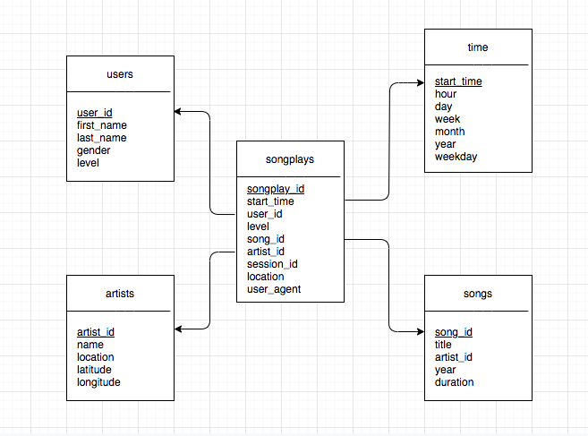

# Data Modeling with Postgres

Udacity Data Engineering Nanodegree Program

Part 2 Data Modeling - Project: Data Modeling with Postgres

## Introduction

A startup called Sparkify wants to analyze the data they've been collecting on songs and user activity on their new music streaming app. The analytics team is particularly interested in understanding what songs users are listening to. Currently, they don't have an easy way to query their data, which resides in a directory of JSON logs on user activity on the app, as well as a directory with JSON metadata on the songs in their app.

They'd like a data engineer to create a Postgres database with tables designed to optimize queries on song play analysis, and bring you on the project. Your role is to create a database schema and ETL pipeline for this analysis. You'll be able to test your database and ETL pipeline by running queries given to you by the analytics team from Sparkify and compare your results with their expected results.

## Project Description

In this project, you'll apply what you've learned on data modeling with Postgres and build an ETL pipeline using Python. To complete the project, you will need to define fact and dimension tables for a star schema for a particular analytic focus, and write an ETL pipeline that transfers data from files in two local directories into these tables in Postgres using Python and SQL.

## Project Files

1. `test.ipynb` displays the first few rows of each table to let you check your database.
2. `create_tables.py` drops and creates your tables. You run this file to reset your tables before each time you run your ETL scripts.
3. `etl.ipynb` reads and processes a single file from `song_data` and `log_data` and loads the data into your tables. This notebook contains detailed instructions on the ETL process for each of the tables.
4. `etl.py` reads and processes files from `song_data` and `log_data` and loads them into your tables. You can fill this out based on your work in the ETL notebook.
5. `sql_queries.py` contains all your sql queries, and is imported into the last three files above.
6. `README.md` provides discussion on your project.

## Database Schema



## Install

```
pip install postgres
```

## Setup

### Create default studentdb in Postgres

```
CREATE DATABASE "studentdb";
CREATE USER student WITH ENCRYPTED PASSWORD 'student';
GRANT ALL PRIVILEGES ON DATABASE studentdb TO student;
```

```
ALTER DATABASE studentdb OWNER TO student;
ALTER USER student CREATEDB;
```

```
psql -d studentdb -U student -W
```

### Setup virtual environment and jupyter notebook

```
pip install virtualenv
virtualenv venv
source venv/bin/activate
pip install psycopg2
```

```
pip install ipykernel, jupyter
ipython kernel install --user --name=venv
jupyter-notebook
```

## Usage

### 1. Create Tables

1. Write `CREATE` statements in `sql_queries.py` to create each table.
2. Write `DROP` statements in `sql_queries.py` to drop each table if it exists.
3. Run `create_tables.py` to create your database and tables.
4. Run `test.ipynb` to confirm the creation of your tables with the correct columns. Make sure to click "Restart kernel" to close the connection to the database after running this notebook.

### 2. Build ETL Processes

Follow instructions in the `etl.ipynb` notebook to develop ETL processes for each table. At the end of each table section, or at the end of the notebook, run `test.ipynb` to confirm that records were successfully inserted into each table. Remember to rerun `create_tables.py` to reset your tables before each time you run this notebook.

### 3. Build ETL Pipeline

Use what you've completed in `etl.ipynb` to complete `etl.py`, where you'll process the entire datasets. Remember to run `create_tables.py` before running `etl.py` to reset your tables. Run `test.ipynb` to confirm your records were successfully inserted into each table.

## Requirement

For all dependencies, please refer to requirements.txt

To install dependencies in the current environment, the command below can be used.

```
pip install -r requirements.txt
```
